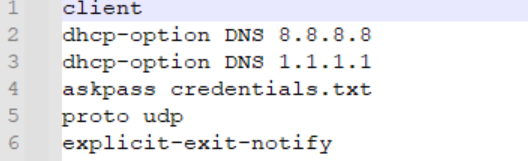
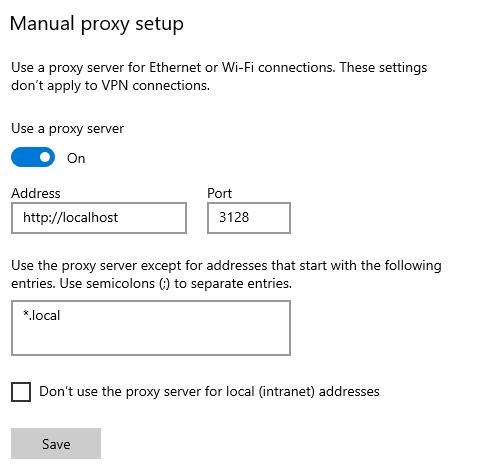

# Docker VPN Proxy

- [Docker VPN Proxy](#docker-vpn-proxy)
  - [Overview](#overview)
  - [Prerequisites](#prerequisites)
    - [Notes](#notes)
  - [Commands](#commands)
    - [Build Image](#build-image)
    - [Run Image](#run-image)
    - [Testing Proxy](#testing-proxy)
  - [Adding Proxy to Windows](#adding-proxy-to-windows)

## Overview

Small repo that describes how to use Docker VPN Proxy.
This proxy allows you to setup a VPN connection within a docker container
and use that VPN connection in a host machine.

## Prerequisites

- Docker
- An existing OpenVPN server that is online
- A VPN config file

### Notes

- If VPN config file is protected with password
  - Create a file called `credentials.txt`
  - Put password inside it
    - Make sure the credential.txt and config file are in the same directory
  - Add `askpass credentials.txt` to the config file
- Make sure to add `dhcp-option` DNS settings if they are not included
  or you may experience internet connectivity issues within the container.
  - Example:

    

## Commands

### Build Image

```bash
docker build -t openvpn-nat .
```

### Run Image

Image relies on port `3128`.
This is the port to use when connecting to the proxy

```bash
docker run --detach --name=openvpn-nat --cap-add=NET_ADMIN --device=/dev/net/tun --volume ~/DIRECTORY_TO_VPN_FILE:/data/vpn -p 3128:3128 openvpn-nat
```

### Testing Proxy

```bash
curl --proxy http://localhost:3128 https://ifconfig.me
```

Check proxy settings in [proxy.sh](./proxy.sh)
If you get a connection error you may have to add your subnet.
`(line 255)`

## Adding Proxy to Windows

Navigate to `Settings > Proxy Settings > Manual proxy setup`


